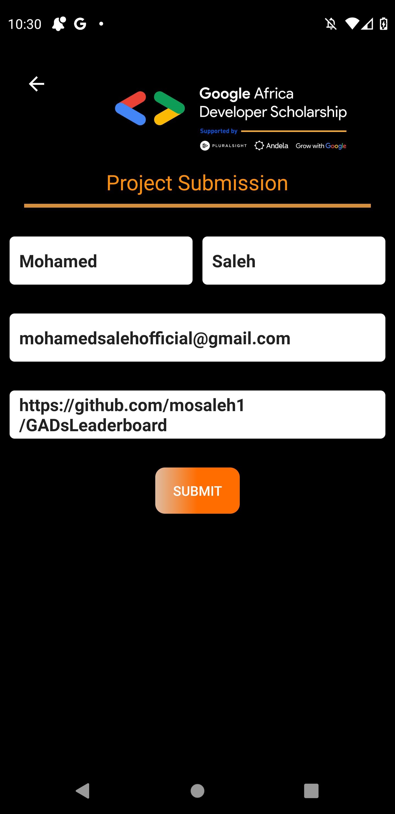
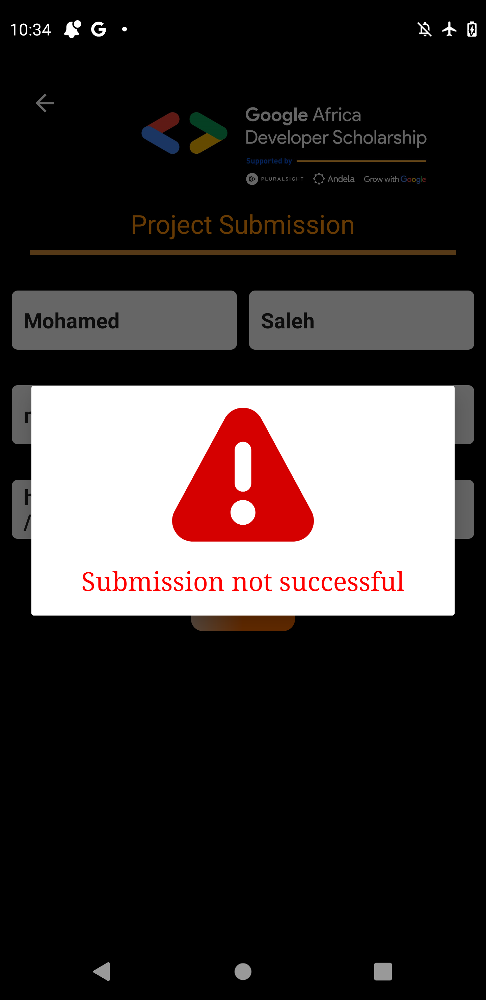
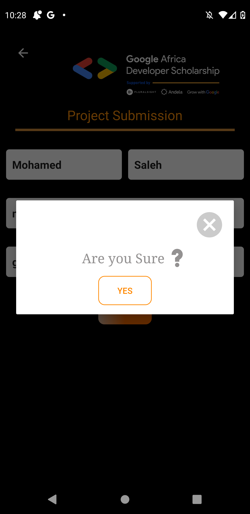
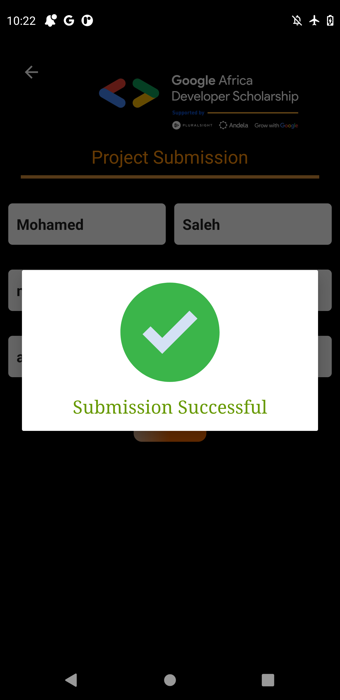

# GADsLeaderboard

full functional app with MVVM design pattern. this app loads data from GADs leaderboard api to retrieve top 20 leaner in IQ_test and top 20 hour learner using 
1-Retrofit 
2-ViewModel 
3-LiveData 
4-MVVM design pattern

